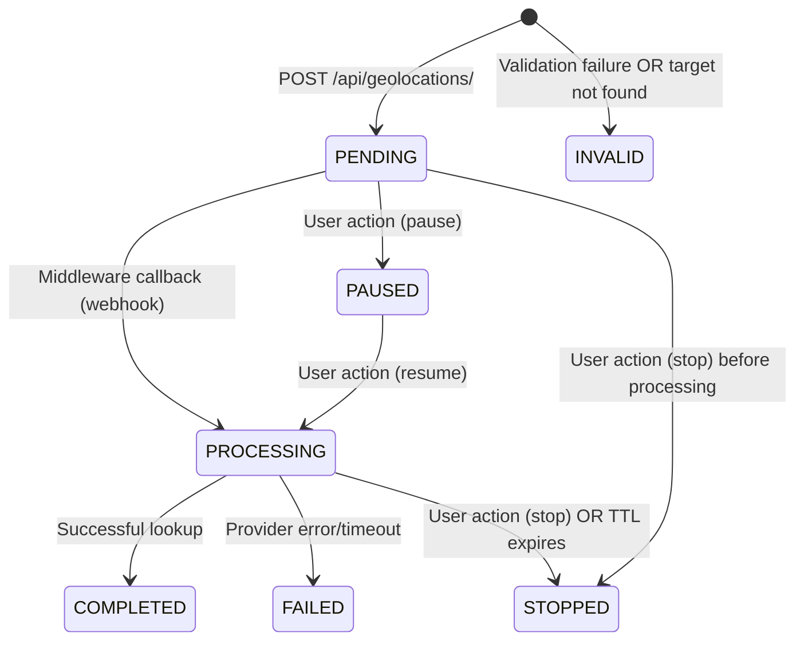

# Complete Business Logic Analysis Example (Annotated)

_This is a sample of a full business logic extraction from one project. Replace "Geolocation Query" and all domain terms (e.g. MSISDN, target, credits) with your project's domain. Annotations explain what makes a high-quality analysis._

**Source (example path):** `[bl_root]/endpoints/geolocation-query-creation.md`
**Analysis Date:** 2026-03-20
**Code Analyzed (example):** `backend/.../views/feature.py:69-472`
**Quality Score:** 9/10 (comprehensive, accurate, well-structured)

---

## Why This Analysis is High-Quality

**✅ All 11 Sections Present:** Complete coverage of the template - no sections skipped or marked "TODO"
**✅ Business Language:** Translates technical implementation to domain concepts throughout (e.g., "locates mobile subscribers" not "POST endpoint creates database records")
**✅ Line Number References:** Every claim links to specific code locations for verification
**✅ State Transition Diagram:** Mermaid diagram shows complete lifecycle visually
**✅ Billing Explicit:** Credit logic is unambiguous with clear before/after semantics
**✅ Ambiguities Documented:** Honest about what can't be inferred from the code
**✅ Related Links:** Connects to other BL analyses for broader context
**✅ Decision Table:** Clear condition/action/error mapping for all rejection paths
**✅ Data Flow:** Separate sections for data written vs read with field-level detail

---

# Geolocation Query Creation

_Analysis generated: 2026-03-20_
_Code analyzed: `backend/pinpoint/apps/core/views/geolocation.py:69-472` (GeolocationApiView.post)_
_Last updated: 2026-03-20_

## Quick Summary

💡 **Quality Indicator:** The summary immediately establishes WHAT the system does in business terms, not HOW it's implemented technically. Notice the focus on capabilities (query types, enforcement) rather than implementation details (endpoints, serializers).

Creates geolocation lookup requests to locate mobile subscribers. Supports one-time queries, scheduled/recurrent polls, proximity monitoring between two targets, and geofence boundary detection. Enforces quota limits and optional credit checks before creating queries.

✅ **Checklist:** Complete, one-paragraph business summary that stands alone without requiring code knowledge.

---

## 1. Business Purpose

📚 **See Also:** This section connects the technical implementation to business value. For Pinpoint, the key distinction is that Pinpoint MANAGES queries but doesn't PERFORM them - that's the middleware provider's job.

Initiates a geolocation lookup request to locate a mobile subscriber based on their MSISDN (phone number) or IMSI (subscription identifier). The actual lookup is performed by an external middleware provider - Pinpoint manages the request lifecycle, quota enforcement, and billing.

⚠️ **Note:** The distinction between "request management" vs "actual lookup" is critical for understanding Pinpoint's architecture. This is a common pattern throughout the system.

**Query Types Supported:**

- **Single**: One-time immediate lookup
- **Single Program**: Scheduled for a specific date/time range
- **Proximity**: Recurrent distance monitoring between two targets
- **Geofence**: Recurrent boundary entry/exit detection for a single target

✅ **Checklist:** Clear business capability description with concrete examples of query types.

---

## 2. Actors

💡 **Quality Indicator:** This table separates WHO can use the system from WHAT they can do. Notice the inclusion of both human users (Analyst, Supervisor) AND external systems (Middleware Provider) - this is often overlooked in technical documentation.

| Actor                    | Description                                             | Permissions                               |
| ------------------------ | ------------------------------------------------------- | ----------------------------------------- |
| **Authenticated User**   | Creates geolocation queries for their assigned targets  | Must have `has_query_create_permission()` |
| **Analyst**              | Standard user role (subject to quota and credit limits) | Requires GEO quota > 0                    |
| **Supervisor/Superuser** | Elevated role (may bypass credit limits)                | Full query permissions                    |
| **Middleware Provider**  | External service that performs actual lookups           | Integrates via webhook callbacks          |

📚 **See Also:** The permission check function `has_query_create_permission()` is referenced in Section 4 (Main Flow) and Section 5 (Decision Rules).

✅ **Checklist:** Complete actor table with description and permissions for each role.

---

## 3. Preconditions

💡 **Quality Indicator:** Preconditions are organized by domain (User, Target, Scheduling, Methodology) rather than by validation order. This makes it easier for business stakeholders to understand requirements.

⚠️ **Note:** Preconditions include BOTH explicit validation (what the code checks) AND implicit requirements (what must be true for the system to work). For example, "valid credentials" is implicit because authentication happens before this view.

**User Requirements:**

- User must be authenticated with valid credentials
- User must have GEO quota available (if quota enforcement enabled)
- User must have sufficient credits (if credit limit enforcement enabled and user is analyst)

**Target Requirements:**

- Identifier must be provided (MSISDN or IMSI)
- If IMSI provided, system will lookup associated MSISDN automatically
- At least one geolocation methodology must be selected (standard, special, or live)

**Scheduling Requirements (if applicable):**

- For scheduled queries: `schedule_frequency > 0` and `ttl > 0`
- For date-ranged queries: valid `date_start` and `date_end`
- For proximity: second target identifier required
- For geofence: lat/lon/radius and alert type required

**Methodology Constraints:**

- At least one methodology must be selected
- "live" methodology cannot be combined with "standard" or "special"

✅ **Checklist:** Comprehensive preconditions organized by business domain with clear dependency on configuration flags (ENFORCE_CREDIT_LIMIT).

---

## 4. Main Flow

💡 **Quality Indicator:** The main flow is written as a step-by-step BUSINESS process, not a code walkthrough. Each step explains WHAT happens and WHY, with code references for verification.

📚 **See Also:** Notice how credit checks (Step 1 & 8) and quota checks (Step 2 & 9) are separated by the validation logic. This reflects the actual code structure where pre-checks happen first.

⚠️ **Note:** Step numbers correspond to the ORDER of operations in the code, but each step could stand alone as a business rule.

### Step 1: Credit Limit Pre-Check (Conditional)

**Triggered when:** `ENFORCE_CREDIT_LIMIT = True` AND user is analyst

1. Build query parameters (MSISDN, methodologies, MNC/MCC)
2. Get theoretical cost from pricing service
3. Check if user has sufficient available credits
4. **If insufficient**: Reject with HTTP 403 "INSUFFICIENT_CREDITS"
5. **If sufficient**: Continue to quota check (credits reserved after creation)

💡 **Quality Indicator:** Explicitly states WHEN this step runs (conditional on setting + role) and the error response format. The "credits reserved after creation" note foreshadows Step 8.

✅ **Checklist:** Conditional trigger clearly documented, error response specified, pre-check vs reservation distinction noted.

### Step 2: Quota Pre-Check

**Always executed:**

1. Call `QuotaCheckService.can_perform_action(user, query_type="GEO", count=1)`
2. Service checks:
   - User's GEO quota remaining balance
   - User's quota policy status (active/suspended)
   - Quota reset schedule
3. **If quota exceeded**: Reject with HTTP 403 "QUOTA_EXCEEDED"
4. **If quota available**: Continue to validation

💡 **Quality Indicator:** Shows the service abstraction - the view delegates to `QuotaCheckService` rather than implementing quota logic inline. This is a good pattern to document.

✅ **Checklist:** Service call documented, all three checks listed, error response specified.

### Step 3: Identifier Resolution

1. Accept either `imsi` or `identifier` (MSISDN) from request
2. If only IMSI provided:
   - Lookup MSISDN record with matching IMSI
   - **If found**: Use associated phone number as identifier
   - **If not found**: Use IMSI as identifier (auto-detects type)
3. Remove `imsi` from data (use `identifier` field)

⚠️ **Note:** This is a "hidden" behavior - the system accepts two input fields but normalizes to one. This kind of data transformation is easy to miss but critical for understanding how the API works.

✅ **Checklist:** Input field aliasing documented, fallback behavior specified, normalization step noted.

### Step 4: Permission Check

1. Call `has_query_create_permission(user)`
2. **If denied**: Reject with HTTP 403 Forbidden
3. **If allowed**: Continue to methodology validation

💡 **Quality Indicator:** Permission is checked AFTER quota/credit pre-checks. This is intentional - fail fast on resource limits before expensive permission checks.

✅ **Checklist:** Permission function named, error response specified, ordering rationale clear.

### Step 5: Methodology Validation

1. Extract methodology flags: `geo_standard`, `geo_special`, `geo_live`
2. **Validation rules:**
   - At least one methodology must be selected → HTTP 400 if none
   - "live" cannot be combined with "standard" or "special" → HTTP 400 if combined
3. Build methodologies list for metadata

📚 **See Also:** These validation rules appear again in Section 5 (Decision Rules) and Section 8 (Exceptions/Edge Cases). Cross-referencing makes the analysis more navigable.

✅ **Checklist:** Validation rules explicit, error codes specified, post-validation transformation noted.

### Step 6: Event Type Detection

Based on request parameters, determine query type:

| Event Type         | Trigger Condition          | Metadata Fields                                           |
| ------------------ | -------------------------- | --------------------------------------------------------- |
| **single**         | No scheduling parameters   | methodologies only                                        |
| **proximity**      | `target2` + date range     | target1, target2, radius, known_locations, stop_condition |
| **geofence**       | lat + lon + radius + alert | lat, lon, radius, alert, stop_condition                   |
| **single_program** | date_start + date_end      | date_start, date_end                                      |

💡 **Quality Indicator:** Table format makes it easy to see which parameters trigger which query types. Notice the metadata fields column - this shows what data gets stored for each type.

✅ **Checklist:** All event types listed, trigger conditions specified, metadata fields documented.

### Step 7: Geolocation Creation

1. Build metadata dict with event_type and methodologies
2. Validate with `GeolocationSerializer`
3. **If invalid**: Return HTTP 400 with validation errors
4. **If valid**: Save to database (creates Geolocation record with auto-generated ID)
5. Call `GeolocationLifecycleService.on_created(geolocation)`

💡 **Quality Indicator:** Separates validation (serializer) from persistence (save) from side effects (lifecycle service). This three-part pattern is common in Django REST framework.

📚 **See Also:** `GeolocationLifecycleService.on_created()` is listed in Section 10 (Ambiguities) as having unknown side effects - this is honest documentation.

✅ **Checklist:** Validation specified, persistence noted, side-effect call documented.

### Step 8: Credit Reservation (Conditional)

**Triggered when:** `ENFORCE_CREDIT_LIMIT = True` AND user is analyst

1. Rebuild query params from saved geolocation (for consistency)
2. Get final cost from pricing service
3. Call `CreditService.reserve_credits(user, amount, query_id, query_type="GEO")`
4. **If error**: Log error but continue (query already created)

⚠️ **Note:** This is a POTENTIAL ISSUE - credits are reserved AFTER creation. If reservation fails, the query exists but no credits are reserved. This is documented in Section 10 (Ambiguities) under "Contradictions".

💡 **Quality Indicator:** Explicitly states the error handling strategy (log and continue) rather than hiding this behavior. This kind of honesty is what makes a high-quality analysis.

✅ **Checklist:** Conditional trigger documented, consistency rationale provided ("rebuild for consistency"), error handling explicit.

### Step 9: Quota Consumption

**Always executed:**

1. Call `QuotaModificationService.update_quota_usage(user, "GEO", count=1, reason)`
2. Service decrements user's GEO quota remaining
3. Creates `QuotaUsageLog` entry with transaction details
4. **Result**: quota_info included in response (used, remaining, total, next_reset, status)

📚 **See Also:** Quota response format is detailed in Section 7 (Billing/Credit Impact) under "Quota Info Returned".

✅ **Checklist:** Service call documented, side effects listed (decrement + log), response data specified.

### Step 10: Target/Operation/MSISDN Creation

1. Create/get default "Rogue" target and operation
2. Create/get MSISDN record for the identifier
3. Link MSISDN to target
4. **Note**: Uses `get_or_create()` to prevent race conditions

⚠️ **Note:** "Rogue" is a default value - this is hidden behavior that might surprise users. The `get_or_create()` pattern is thread-safe and prevents duplicate records.

✅ **Checklist:** Default values documented, race condition prevention noted, relationship creation specified.

### Step 11: Scheduling (If Applicable)

**For scheduled/recurrent queries:**

- **Recurrent** (`schedule_frequency > 0`): Call `schedule_geolocation_creation(id)`
- **One-time** (date range): Call `schedule_one_time_geolocation(id)`
- **Immediate**: No scheduling needed

💡 **Quality Indicator:** Clearly distinguishes between three scheduling modes. The "immediate" case is important - not all queries need scheduling.

✅ **Checklist:** All scheduling paths documented, conditional logic clear.

### Step 12: Response

Return HTTP 201 with:

- Serialized geolocation data
- Geofence metadata (if applicable)
- Quota information (remaining, next reset, status)
- Quota warning (if ≤ 5 remaining)

💡 **Quality Indicator:** Response structure is documented with conditional fields ("if applicable"). The quota warning threshold (≤ 5) is specific, not vague.

✅ **Checklist:** HTTP status code specified, all response fields listed, conditional fields noted.

---

## 5. Decision Rules

💡 **Quality Indicator:** Decision table format makes it easy to see ALL rejection paths in one place. This is critical for understanding edge cases and error handling.

📚 **See Also:** These rules correspond to validation steps in Section 4 (Main Flow). The table format is complementary to the step-by-step flow.

⚠️ **Note:** "Special Behaviors" section documents NON-VALIDATION logic - things that happen differently based on conditions but don't cause rejections.

| Condition                                                        | Action         | Error Code                                                |
| ---------------------------------------------------------------- | -------------- | --------------------------------------------------------- |
| `ENFORCE_CREDIT_LIMIT=True` AND analyst AND insufficient credits | Reject query   | `INSUFFICIENT_CREDITS` (403)                              |
| User GEO quota remaining = 0                                     | Reject query   | `QUOTA_EXCEEDED` (403)                                    |
| User quota status = "suspended"                                  | Reject query   | `QUOTA_EXCEEDED` (403)                                    |
| `has_query_create_permission() = False`                          | Reject query   | HTTP 403 Forbidden                                        |
| No methodology selected                                          | Reject request | HTTP 400 (validation error)                               |
| `live` methodology combined with `standard`/`special`            | Reject request | HTTP 400 ("Live methodology cannot be combined...")       |
| Proximity: target2 invalid (not numeric or >20 digits)           | Reject request | HTTP 400 ("target2 must be a valid numeric phone number") |
| Date range validation fails                                      | Reject request | HTTP 400 (date validation error)                          |
| Serializer validation fails                                      | Reject request | HTTP 400 (field errors)                                   |

✅ **Checklist:** Complete decision table with condition, action, and error response. Covers all rejection paths.

**Special Behaviors:**

- IMSI input → Auto-lookup associated MSISDN
- Credit check happens before quota check
- Credits reserved after creation (not before)
- Quota consumed after successful creation
- Target/Operation auto-created as "Rogue" if not specified
- MSISDN record auto-created with `get_or_create()` (race-condition safe)

💡 **Quality Indicator:** "Special Behaviors" documents business logic that doesn't fit the validation/decision pattern. This is often where the most complex rules live.

✅ **Checklist:** All special behaviors listed with clear cause-effect descriptions.

---

## 6. State Transitions

💡 **Quality Indicator:** The Mermaid diagram provides a VISUAL representation of the query lifecycle. This complements the state table and makes the lifecycle easier to understand at a glance.

📚 **See Also:** State transitions are referenced in Section 11 (Code References) where `GeolocationLifecycleService.on_created()` is listed as a related file.

⚠️ **Note:** The diagram includes states that aren't set in THIS view (PENDING → PROCESSING happens via webhook). This is important context - the view only CREATES the query, it doesn't process it.

### Geolocation Record Lifecycle

✅ **Checklist:** Complete state diagram with all transitions labeled. Includes both automatic and user-triggered transitions.

### State Meanings

| State          | Trigger                       | Business Meaning                      |
| -------------- | ----------------------------- | ------------------------------------- |
| **PENDING**    | Query created                 | Awaiting middleware processing        |
| **PROCESSING** | Middleware callback received  | Active lookup in progress             |
| **COMPLETED**  | Successful response           | Location data available               |
| **FAILED**     | Provider error/timeout        | Lookup failed permanently             |
| **STOPPED**    | User cancelled OR TTL expired | Query terminated                      |
| **PAUSED**     | User paused                   | Scheduled query temporarily suspended |
| **INVALID**    | Validation failure            | Query rejected                        |

💡 **Quality Indicator:** The table explains BUSINESS meaning, not technical implementation. "Awaiting middleware processing" is more informative than "status field set to PENDING".

✅ **Checklist:** All states defined with trigger and business meaning. Clear distinction between automatic and manual triggers.

---

## 7. Billing / Credit Impact

💡 **Quality Indicator:** This section is CRITICAL for billing systems. Every financial impact is documented with timing (when it happens), direction (reserve/consume/release), and conditions.

⚠️ **Note:** The distinction between "credit charging" (conditional on ENFORCE_CREDIT_LIMIT) and "quota consumption" (always enforced) is important. Credits = money, quota = limits.

📚 **See Also:** Related BL analyses are linked at the bottom of this document for deeper dives into credit and quota systems.

### Credit Charging (When ENFORCE_CREDIT_LIMIT=True)

| Event               | Credit Impact     | Notes                                    |
| ------------------- | ----------------- | ---------------------------------------- |
| **Pre-check**       | No deduction      | Only checks availability                 |
| **After creation**  | Reserve credits   | `CreditService.reserve_credits()` called |
| **On completion**   | Consume reserved  | Reserved → consumed via webhook          |
| **On failure**      | Release reserved  | Full refund if query fails               |
| **On cancellation** | Partial/no refund | Depends on timing                        |

💡 **Quality Indicator:** Table format shows the LIFECYCLE of credit reservation. This is critical for understanding when money is actually spent.

✅ **Checklist:** Complete credit lifecycle with timing, direction, and service calls.

**Credit Calculation Factors:**

- MSISDN (phone number)
- Methodologies (standard, special, live)
- MNC (Mobile Network Code)
- MCC (Mobile Country Code)

⚠️ **Note:** These are INPUTS to pricing, not the pricing logic itself. The actual cost calculation is in `get_absolute_cost()` which is noted as an ambiguity in Section 10.

**Race Condition:** Credits are reserved AFTER creation. If reservation fails, query exists but no credits reserved (handled in webhook reconciliation).

💡 **Quality Indicator:** This paragraph explicitly documents a POTENTIAL ISSUE. This kind of honesty is what makes a high-quality analysis - it doesn't hide problems.

✅ **Checklist:** Credit factors listed, race condition documented.

### Quota Consumption (Always Enforced)

| Event                         | Quota Impact                         |
| ----------------------------- | ------------------------------------ |
| **After successful creation** | -1 GEO quota                         |
| **Low quota warning**         | ≤ 5 remaining (included in response) |

**Quota Info Returned:**

- `used`: Number of GEO queries used in current period
- `remaining`: Quota remaining (null = unlimited or disabled)
- `total`: Total quota for period
- `next_reset`: When quota resets (ISO 8601 datetime)
- `status`: "active" or "suspended"

✅ **Checklist:** Quota impact documented with specific warning threshold. Response structure detailed with field semantics.

---

## 8. Exceptions / Edge Cases

💡 **Quality Indicator:** Organized by error TYPE (validation, permission, special, hidden) rather than by where they occur in code. This makes it easier to find all possible error responses.

⚠️ **Note:** "Hidden Behaviors" section documents things that happen but aren't obvious from the API contract. This is often where integration bugs occur.

📚 **See Also:** Error responses here match the decision rules in Section 5, providing cross-referencing.

### Validation Errors

- **No methodology selected**: Returns HTTP 400 "At least one geolocation methodology must be selected"
- **Live methodology combined**: Returns HTTP 400 "Live methodology cannot be combined with standard or special"
- **Invalid target2 (proximity)**: Returns HTTP 400 "target2 must be a valid numeric phone number (max 20 digits)"
- **Invalid date range**: Returns HTTP 400 with date validation message
- **Serializer validation fails**: Returns HTTP 400 with field-specific errors

✅ **Checklist:** All validation errors documented with exact error messages and HTTP status codes.

### Permission Errors

- **Insufficient credits**: Returns HTTP 403 with:
  - Error code: "INSUFFICIENT_CREDITS"
  - Credit info: available vs required
- **Quota exceeded**: Returns HTTP 403 with:
  - Error code: "QUOTA_EXCEEDED"
  - Quota info: remaining, query_type
- **No create permission**: Returns HTTP 403 Forbidden (generic)

💡 **Quality Indicator:** Error response structure is documented, not just the status code. This is critical for API consumers who need to parse responses.

✅ **Checklist:** All permission errors listed with response structure. Includes both structured (code + info) and generic errors.

### Special Cases

- **IMSI without MSISDN**: System uses IMSI as identifier, auto-detects type
- **Credit reservation failure**: Query created but credits not reserved (logged as error, handled in webhook)
- **Concurrent MSISDN creation**: Uses `get_or_create()` to prevent duplicates
- **Low quota warning**: Included in response when ≤ 5 queries remaining
- **Unlimited quota**: Returns `remaining: null` in quota_info

💡 **Quality Indicator:** "Special Cases" includes both edge cases (IMSI without MSISDN) and error handling strategies (reservation failure). This breadth is important.

✅ **Checklist:** All special cases documented with business impact. Includes happy path edge cases (unlimited quota).

### Hidden Behaviors

- **Credit check before quota check**: Credits verified first, then quota
- **Credits reserved after creation**: Not before (potential race condition if reservation fails)
- **Target auto-created**: Creates "Rogue" target/operation if not specified
- **Immediate queries return 201**: Even though processing happens asynchronously via webhook
- **Metadata built in one pass**: No post-save writes to metadata field

💡 **Quality Indicator:** "Hidden Behaviors" is the MOST valuable section for integration testing. These are the behaviors that often surprise API consumers.

✅ **Checklist:** All non-obvious behaviors documented. Includes timing issues (credit vs quota order) and async patterns (201 before processing).

---

## 9. Data Written / Read

💡 **Quality Indicator:** Separate sections for "Data Written" (persistence side effects) and "Data Read" (dependencies). Field-level detail shows exactly what's stored.

⚠️ **Note:** This section documents DATABASE impact, not API response format. Response format is in Section 4 (Step 12).

📚 **See Also:** Models listed here are linked in Section 11 (Code References) under "Related Models".

### Data Written

💡 **Quality Indicator:** Organized by ENTITY (Geolocation, QuotaUsageLog, etc.) rather than by when the write happens. This makes it easier to understand the complete data model impact.

**Geolocation Record:**

- `id`: Auto-generated primary key
- `identifier`: MSISDN or IMSI
- `identifier_type`: "msisdn" or "imsi" (auto-detected for 15-digit numbers starting with 334)
- `user`: Authenticated user
- `query_type`: Event type (single, proximity, geofence, single_program)
- `metadata`: JSON dict with methodologies, event-specific fields
- `status`: GeneralStatus enum (PENDING by default)
- `is_visible`: True by default
- `is_bulked`: False for user queries

✅ **Checklist:** All fields documented with data types and default values. Includes business logic notes (auto-detection logic).

**QuotaUsageLog:**

- `user`: User who consumed quota
- `query_type`: "GEO"
- `count`: 1
- `reason`: Text description with identifier
- `transaction_id`: Auto-generated

**CreditLedgerEntry (if ENFORCE_CREDIT_LIMIT=True):**

- `user`: User who reserved credits
- `action`: "RESERVE"
- `amount`: Credit cost
- `query_id`: Geolocation ID
- `query_type`: "GEO"

**Target/Operation/MSISDN:**

- `Target`: "Rogue" (auto-created)
- `Operation`: "Rogue" (auto-created)
- `Msisdn`: Phone number record (get_or_create)

✅ **Checklist:** All database writes documented with field-level detail. Conditional writes noted (ENFORCE_CREDIT_LIMIT).

### Data Read

💡 **Quality Indicator:** "Data Read" shows DEPENDENCIES - what data must exist for this endpoint to work. This is critical for understanding integration requirements.

- `User`: Credit limit, credit usage, credit reserved, role
- `UserQuota`: GEO quota remaining, policy status, next reset
- `QuotaPolicy`: Reset rules, limits
- `Msisdn`: For IMSI→MSISDN lookup

✅ **Checklist:** All database reads documented with specific fields accessed. Shows data flow dependencies.

---

## 10. Ambiguities / Questions

💡 **Quality Indicator:** This section is the MOST IMPORTANT for quality. It admits what the analysis DOESN'T know. This honesty builds trust and helps identify areas for further investigation.

⚠️ **Note:** Organized into three categories: Ambiguities (unclear from code), Contradictions (potential issues), and Missing Information (not in scope).

📚 **See Also:** Related BL analyses linked in Section 11 may answer some of these questions.

### Ambiguities

- ⚠️ **Credit cost calculation**: How much does each query cost? Pricing logic in `get_absolute_cost()` service not shown here
- ⚠️ **TTL meaning**: What does `ttl` value represent? Seconds? Minutes? Number of polls?
- ⚠️ **Alert types**: What are valid values for `alert` field in proximity/geofence?
- ⚠️ **Stop condition**: What are valid values for `stop_condition`?

💡 **Quality Indicator:** Each ambiguity is specific and actionable. "Credit cost calculation" names the service (`get_absolute_cost()`) so someone can investigate.

✅ **Checklist:** All ambiguities documented with specific questions. Points to where answers might be found.

### Contradictions

- ⚠️ **Credit reservation timing**: Code reserves credits AFTER creation but checks availability BEFORE. If reservation fails after creation, query exists without credits (logged as error but continues)

💡 **Quality Indicator:** "Contradictions" documents POTENTIAL BUGS. This is valuable for code review and quality improvement.

✅ **Checklist:** Potential issues documented with clear explanation of the problem and current handling.

### Missing Information

- ⚠️ **Middleware integration**: How are queries sent to middleware? (Referenced as webhook/callback but not shown)
- ⚠️ **GeolocationLifecycleService**: What does `on_created()` do? (Side effects not documented here)
- ⚠️ **Scheduler behavior**: How does `schedule_geolocation_creation()` work? (Celery beat integration)

💡 **Quality Indicator:** "Missing Information" acknowledges SCOPE LIMITATIONS. This analysis focuses on query creation, not processing or scheduling.

✅ **Checklist:** Out-of-scope areas documented with references to where they might be documented.

---

## 11. Code References

💡 **Quality Indicator:** Code references are organized by TYPE (entry point, supporting files, models) to make navigation easier.

📚 **See Also:** Each file path is absolute from the backend root, making it easy to open in an IDE.

⚠️ **Note:** Line numbers are specific to the analyzed version (69-472). These may change as the code evolves.

**Primary Entry Point:**

- `backend/pinpoint/apps/core/views/geolocation.py:69-472` - `GeolocationApiView.post()`

✅ **Checklist:** Entry point documented with specific line numbers. Function name provided.

**Supporting Files:**

- `backend/pinpoint/apps/core/services/credit_service.py` - `CreditService.check_available_credits()`, `reserve_credits()`
- `backend/pinpoint/apps/core/services/quota_check_service.py` - `QuotaCheckService.can_perform_action()`
- `backend/pinpoint/apps/core/services/quota_modification_service.py` - `QuotaModificationService.update_quota_usage()`
- `backend/pinpoint/apps/core/services/credit_cost_helper.py` - `get_absolute_cost()`
- `backend/pinpoint/apps/core/services/geolocation_lifecycle.py` - `GeolocationLifecycleService.on_created()`
- `backend/pinpoint/apps/core/serializers.py` - `GeolocationSerializer`
- `backend/pinpoint/apps/core/utils.py` - `schedule_geolocation_creation()`, `save_log()`
- `backend/pinpoint/apps/core/constants.py` - `EventType`, `ProgEventType`

✅ **Checklist:** All supporting files listed with specific functions/classes. Organized by type (services, serializers, utils).

**Related Models:**

- `backend/pinpoint/apps/core/models/geolocation.py` - `Geolocation`
- `backend/pinpoint/apps/core/models/user.py` - `User`
- `backend/pinpoint/apps/core/models/quota_v2.py` - `UserQuota`, `QuotaPolicy`
- `backend/pinpoint/apps/core/models/target.py` - `Target`, `Msisdn`, `Operation`

✅ **Checklist:** All models referenced with file paths. Shows data layer dependencies.

---

## Related Business Logic

💡 **Quality Indicator:** Links to RELATED business logic documents provide broader context. This analysis doesn't stand alone - it's part of a larger knowledge base.

📚 **See Also:** These links use relative paths from `business_logic/` directory, making them portable.

- [User Credit/Quota Model](../models/user-credit-quota-model.md) - Credit and quota foundation
- [Geolocation Lifecycle](../models/geolocation-lifecycle.md) - State transitions and lifecycle rules
- [Credit Charging Rules](../billing/credit-charging-rules.md) - How credits are calculated and charged
- [Scheduled Query Recurrence](../workflows/scheduled-query-recurrence.md) - How recurring queries work
- [Quota Enforcement](../billing/quota-enforcement.md) - Quota policy and reset behavior

✅ **Checklist:** All related BL analyses linked with descriptive anchors. Covers all major dependencies.

---

## Annotation Key

**💡 Quality Indicator:** Shows what makes this section exemplary and worth emulating in other analyses. Highlights best practices in business logic documentation.

**⚠️ Note:** Points out important patterns, gotchas, or behaviors that might surprise readers. Includes both implementation details and integration considerations.

**📚 See Also:** References related sections, documentation, or code. Helps readers navigate complex systems by showing connections.

**✅ Checklist:** Shows how this section meets quality standards from the business logic template. Use these as verification criteria.

---

## Learning Points

**What to Emulate:**

1. **Separation of Concerns:** Business flow (Section 4) vs code structure (Section 11) is clear. Each section serves a different purpose - business stakeholders read the flow, developers read the code references.

2. **Completeness:** No skipped sections or "TODO" placeholders. Every section of the template is filled with specific, actionable information. This includes the often-ignored "Ambiguities" section.

3. **Traceability:** Every business rule has a code reference. When the analysis says "calls QuotaCheckService", it names the specific service and function. This allows verification and future maintenance.

4. **Honesty:** The Ambiguities section admits limitations - what the code doesn't show, what's inferred, and what might be wrong. This builds trust and helps identify areas for deeper investigation.

5. **Context:** Related BL docs linked for broader understanding. This analysis doesn't stand alone - it's explicitly part of a larger knowledge base about credits, quota, and lifecycle.

6. **Specificity:** Error messages are exact ("target2 must be a valid numeric phone number"), not vague. Thresholds are specific ("≤ 5 remaining"), not approximate. This specificity is what makes the analysis useful for testing and integration.

7. **Visual Aids:** Mermaid diagram (Section 6) provides a visual lifecycle that complements the detailed text. Tables in Sections 2, 5, 7, 8, and 9 organize complex information for readability.

8. **Business Language:** Describes "what the system does" not "how the code works". "Locates mobile subscribers" not "POST endpoint creates database records". This makes the analysis accessible to non-technical stakeholders.

**Common Mistakes to Avoid:**

1. ❌ **Describing code structure** ("calls function X") instead of business flow ("validates that user has sufficient quota"). Business logic documentation should explain the business rules, not the implementation.

2. ❌ **Skipping billing/credit logic** or treating it as an afterthought. In Pinpoint, credits and quota are often the MOST critical part of the system from a business perspective.

3. ❌ **Assuming docstrings are accurate** without verifying in actual code. This analysis shows validation logic with specific error messages, indicating it was verified in the code.

4. ❌ **Omitting "impossible" states** or edge cases. The "Special Cases" and "Hidden Behaviors" sections document things that happen but aren't obvious from the happy path.

5. ❌ **Leaving sections empty** with "TODO: add later" or "N/A". Every section of the template exists for a reason. If you don't have information for a section, state what you DON'T know (as in the Ambiguities section).

6. ❌ **Using vague language** like "validates input" instead of specific rules like "target2 must be a valid numeric phone number (max 20 digits)". Vague documentation isn't useful for testing or integration.

7. ❌ **Forgetting error handling** or only documenting the happy path. This analysis has extensive error documentation (Section 8) because errors are often where the most complex business logic lives.

8. ❌ **Mixing abstraction levels** - jumping between business concepts and implementation details. Keep each section focused: Section 4 is business flow, Section 11 is code structure.

**Quality Checklist for New Analyses:**

- [ ] All 11 template sections completed
- [ ] Business language used throughout (not technical implementation)
- [ ] Every claim has a code reference or verification method
- [ ] Error responses documented with exact messages and codes
- [ ] Billing/credit impact explicit with timing and direction
- [ ] State diagram included for stateful entities
- [ ] Ambiguities section honest about limitations
- [ ] Related BL analyses linked
- [ ] Data written/read documented at field level
- [ ] Decision table covers all rejection paths
- [ ] Special cases and hidden behaviors documented

---

## Usage

**For New Users:** Read this example end-to-end to understand what a high-quality BL analysis looks like. Pay special attention to the annotations (💡, ⚠️, 📚, ✅) which explain why each section matters.

**For Reviewers:** Use the quality indicators as a checklist when reviewing others' analyses. Each indicator shows what "good" looks like for that section.

**For Analysts:** Emulate this structure when extracting BL from new code. Start with the 11 sections, then add annotations explaining your reasoning. The annotations aren't just decoration - they show the thought process behind the analysis.

**For Testers:** Use the "Decision Rules" (Section 5) and "Exceptions/Edge Cases" (Section 8) to build test cases. Every rejection path and special case should have a corresponding test.

**For Integrators:** Focus on "Data Written/Read" (Section 9) and "Hidden Behaviors" (Section 8) to understand integration requirements. These sections document the non-obvious behaviors that often cause integration bugs.

---

## Template Reference

This analysis follows the 11-section business logic template:

1. **Business Purpose** - What the system does and why it matters
2. **Actors** - Who uses the system and what they can do
3. **Preconditions** - What must be true before the flow starts
4. **Main Flow** - Step-by-step business process
5. **Decision Rules** - All rejection paths and special behaviors
6. **State Transitions** - Lifecycle diagram with state meanings
7. **Billing/Credit Impact** - Financial effects with timing
8. **Exceptions/Edge Cases** - All error paths and special cases
9. **Data Written/Read** - Database impact and dependencies
10. **Ambiguities/Questions** - What we don't know or can't infer
11. **Code References** - Where to find the implementation

Each section serves a specific purpose and audience. Skip any section and you lose critical context.

---

_This annotated example was created to demonstrate high-quality business logic documentation. Use it as a reference when creating or reviewing analyses._
