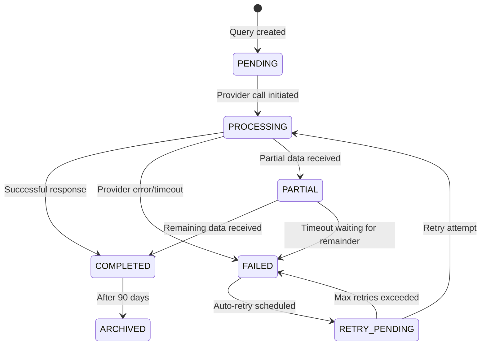

# Business Logic Reverse Engineering

*Generated from code analysis on {DATE}*

## 1. Business Purpose

What business capability this code provides.

**Example:**
> This code creates an order from validated request data and reserves inventory (replace with your domain).

---

## 2. Actors

Who uses or triggers this functionality.

**Example:**
> - **Internal User**: User performing the operation
> - **API Client**: External system integrating with the platform
> - **Scheduler**: Automated periodic jobs
> - **Admin**: Operations team manually triggering actions

---

## 3. Preconditions

What must be true before this code runs successfully.

**Example:**
> - User must be authenticated and authorized for this operation
> - Required entities must exist and be in a valid state
> - Account balance (if applicable) must be sufficient
> - External services (if any) must be reachable

---

## 4. Main Flow

Step-by-step business flow, NOT code structure.

**Example:**
> 1. **Validate request**: Check input format and permissions
> 2. **Determine eligibility**: Verify preconditions and balance (if applicable)
> 3. **Choose route**: Select handler or provider if multiple options exist
> 4. **Execute operation**: Call service or external API
> 5. **Normalize result**: Convert response to standard format
> 6. **Update record**: Persist state and side effects
> 7. **Charge/record** (if applicable): Deduct balance or record transaction
> 8. **Return response**: Provide result to caller

---

## 5. Decision Rules

Explicit if/then rules in business language.

**Example:**
> | Condition | Action |
> |-----------|--------|
> | Invalid or missing required field | Reject with clear validation error |
> | Insufficient balance/quota | Reject with "Insufficient balance" (or equivalent) |
> | External service timeout | Retry with fallback or retry policy |
> | All retries fail | Mark as FAILED, apply refund policy if any |
> | Operation cancelled after commit | No refund (already consumed) |
> | Business rule violation | Reject with specific reason |

---

## 6. State Transitions

How statuses change during the flow.

**Example:**

**State meanings:**
- **PENDING**: Created but not yet sent to provider
- **PROCESSING**: Active request in flight to provider
- **COMPLETED**: Successfully received location data
- **FAILED**: Permanently failed (no more retries)
- **PARTIAL**: Incomplete data received
- **RETRY_PENDING**: Scheduled for retry attempt
- **ARCHIVED**: Historical record (read-only)

---

## 7. Billing / Credit Impact

When credits are charged, refunded, skipped, or adjusted.

**Example (omit or shorten if no billing):**
> | Event | Impact |
> |-------|--------|
> | Operation created | Charge/reserve per policy |
> | Operation fails (before commit) | Refund/release per policy |
> | Timeout or partial failure | Partial refund or no refund per policy |
> | User cancels before commit | Full refund/release |
> | User cancels after commit | No refund (or per policy) |
> | Retry attempt | No double charge; idempotency per policy |

---

## 8. Exceptions / Edge Cases

Invalid input, unsupported paths, fallback behavior, and special cases.

**Example:**
> - **Empty response from external service**: Treated as failure; apply error/refund policy
> - **Invalid or boundary values**: Document how they are validated and returned
> - **Duplicate request**: Idempotency rules (e.g. return cached result, no double charge)
> - **Entity invalidated during operation**: Mark as FAILED; refund/release per policy
> - **Concurrent operations**: Document locking, ordering, or caching behavior
> - **Schema or format mismatch**: How validation and fallback behave
> - **Network/timeout**: How long the system waits; what state is set after timeout
> - **Race conditions**: Any balance/quantity races and how they are prevented or handled

---

## 9. Data Written / Read

Key business-relevant persistence effects.

**Example:**
> **Written:**
> - Main domain record(s) (e.g. Order, Request, Job) with status and key fields
> - Transaction/ledger entries if billing applies
> - Audit log entries if required
> - Cache or idempotency keys if used
>
> **Read:**
> - Entity records needed for eligibility and routing
> - Account/balance or quota
> - Configuration (routing, retry, limits)
> - Cache for idempotency or deduplication

---

## 10. Ambiguities / Questions

What cannot be safely inferred from the code.

**Example:**
> - ⚠️ **Unclear**: What happens if balance goes negative (or similar) during the operation?
> - ⚠️ **Unknown**: Retry count and backoff (fixed vs unbounded)
> - ⚠️ **Contradiction**: Doc vs code on timing or thresholds (note exact values)
> - ⚠️ **Missing**: No handling for rate limits or specific error codes
> - ⚠️ **Unclear**: When refunds or adjustments apply (automatic vs manual)
> - ⚠️ **Contradiction**: Code vs comments or docs on when charges are applied

---

## 11. Code References

Specific files and line numbers for traceability.

**Example:**
> - Entry point: `path/to/views.py:start-end` (`HandlerName.create` or equivalent)
> - Validation: `path/to/validators.py:line-range`
> - External call: `path/to/service.py:line-range`
> - Charge/billing (if any): `path/to/billing.py:line-range`
> - State updates: `path/to/models.py:line-range` (method or handler that updates state)

---

*End of analysis*
