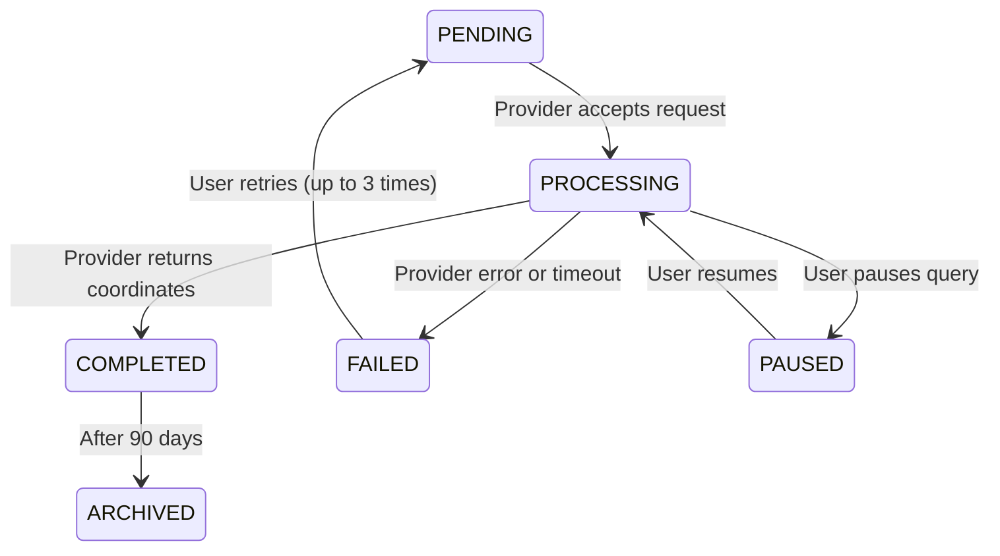

# Validation and Quality Assurance

_Last updated: 2026-03-15_

## Overview

This reference provides comprehensive guidance for validating business logic documentation, handling ambiguities, conducting peer reviews, and maintaining documentation quality over time.

---

## Handling Ambiguities

When you can't infer business logic from code, it's critical to document what you don't know rather than guessing.

### DO: Document Explicitly

✅ **Use Section 10 (Ambiguities/Questions)** for all uncertainties
✅ **Explain WHY you can't infer** (missing code? conflicting logic? no documentation?)
✅ **Suggest how to resolve** (ask domain expert? check config? test behavior?)
✅ **Use "UNKNOWN:" prefix** for clarity
✅ **Include line numbers** where the ambiguity exists

**Example:**

```markdown
## 10. Ambiguities / Questions

**UNKNOWN: TTL field purpose**

- **Location:** `geolocation.py:145` (TTL parameter)
- **What we know:** Code sets default=3600, but no business rationale documented
- **Why ambiguous:** No comment in code, no specification document
- **Impact:** Unknown if this is timeout, retry interval, or data retention
- **Suggested resolution:** Ask product team or check middleware API documentation
- **Code reference:** `backend/pinpoint/apps/core/views/geolocation.py:145`
```

### DON'T: Guess or Assume

❌ **Don't invent business rules** - if it's not in the code, don't document it
❌ **Don't copy from docstrings** - they're often stale or incomplete
❌ **Don't leave section empty** - explain what you tried and why it failed
❌ **Don't assume "obvious" behavior** - what's obvious to you may not be to others
❌ **Don't infer from variable names** - `retry_count` doesn't tell you the business reason for retrying

### Common Ambiguity Patterns

**Pattern 1: Default Values Without Rationale**

```markdown
**UNKNOWN: Default quota limit of 1000**

- **Location:** `models/user.py:45` (quota_limit field)
- **What we know:** Default is 1000, max is 10000
- **Why ambiguous:** No business reason for 1000 vs 500 or 2000
- **Impact:** Affects user provisioning and cost modeling
- **Suggested resolution:** Check with product team on quota strategy
```

**Pattern 2: Silent Failure Modes**

```markdown
**UNKNOWN: Empty except block at line 289**

- **Location:** `services/credit.py:289`
- **What we know:** Catches all exceptions but logs nothing
- **Why ambiguous:** Is this intentional (best-effort) or a bug?
- **Impact:** Failures are silently swallowed, no retry logic
- **Suggested resolution:** Add logging or remove try/except
- **Risk:** HIGH - may hide critical errors
```

**Pattern 3: Config-Driven Behavior**

```markdown
**UNKNOWN: Behavior when FEATURE_X_ENABLED = False**

- **Location:** Multiple files check this setting
- **What we know:** Code branches based on this flag
- **Why ambiguous:** Only tested with True, False path untested
- **Impact:** Unknown if system works correctly when disabled
- **Suggested resolution:** Test with flag set to False
```

**Pattern 4: Partial Success Semantics**

```markdown
**UNKNOWN: Batch query partial failure handling**

- **Location:** `views/bulk_query.py:78-102`
- **What we know:** Some items can succeed while others fail
- **Why ambiguous:** Unclear if client gets partial results or error
- **Impact:** Affects client retry logic and user experience
- **Suggested resolution:** Test with mixed success/failure scenario
```

**Pattern 5: Race Conditions**

```markdown
**UNKNOWN: Credit deduction before validation**

- **Location:** `views/geolocation.py:167 (deduct), 182 (validate)`
- **What we know:** Credits deducted BEFORE validation completes
- **Why ambiguous:** Could cause temporary negative balance
- **Impact:** Users might see "insufficient credits" erroneously
- **Suggested resolution:** Ask if this is intentional (optimization) or bug
```

### Ambiguity Resolution Workflow

**Step 1: Document First**

- Add to Section 10 immediately
- Don't delay the entire analysis for one ambiguity
- Be specific about what you don't know

**Step 2: Categorize by Impact**

- **HIGH:** Affects billing, security, data integrity → escalate to team
- **MEDIUM:** Affects UX, performance → add to backlog
- **LOW:** Nice-to-know → document for future reference

**Step 3: Attempt Resolution**

- **Code inspection:** Look for comments, tests, or related code
- **Config files:** Check settings.py, environment variables
- **Tests:** Read test files for behavioral clues
- **Domain experts:** Ask product, senior devs, or support team

**Step 4: Update Documentation**

- When resolved, remove from Section 10
- Add to appropriate section (1-9) with explanation
- Note how it was resolved (e.g., "RESOLVED: Team confirmed X")

### When to Admit "I Don't Know"

**Always admit uncertainty when:**

- Code has multiple conflicting behaviors
- No tests exist for the path
- Comments contradict the implementation
- Variable names are misleading
- Behavior depends on external state (config, database, external API)

**Better to be honest than wrong:**

- ❌ Bad: "Retries 3 times" (code actually retries indefinitely)
- ✅ Good: "UNKNOWN: Retry behavior - code loops until success but no max retry documented"

---

## Quality Validation Checklist

### Completeness

- [ ] **All 11 sections present and non-empty**
  - Section 1: Purpose and Scope
  - Section 2: Primary Actor(s)
  - Section 3: Preconditions
  - Section 4: Main Flow
  - Section 5: Decision Rules
  - Section 6: State Transitions
  - Section 7: Billing/Credit Impact
  - Section 8: Exceptions/Edge Cases
  - Section 9: Related Business Logic
  - Section 10: Ambiguities/Questions
  - Section 11: Code References

- [ ] **Line numbers included for all claims**
  - Every business rule has a code location
  - Format: `filepath.py:123` or `filepath.py:123-145`
  - Critical sections (billing, state machines) have line ranges

- [ ] **Billing/credit logic explicit**
  - No "see billing docs" placeholders
  - Exact credit amounts documented
  - Refund conditions specified
  - Race conditions noted

- [ ] **State transitions have Mermaid diagram**
  - All states from enum included
  - All transitions documented
  - State meanings explained
  - "Impossible" states noted if code handles them

- [ ] **Ambiguities documented where appropriate**
  - Section 10 used for uncertainties
  - Impact levels assigned (HIGH/MEDIUM/LOW)
  - Resolution suggestions provided
  - Line numbers referenced

### Quality

- [ ] **Business language used (not technical)**
  - Section 4 describes WHAT happens, not HOW
  - No "calls function X" or "invokes method Y"
  - Use domain terminology (e.g., "reserve quota" not "call QuotaService")

- [ ] **Domain terminology from expertise.yaml**
  - Consistent terminology across documents
  - Acronyms explained on first use
  - Links to glossary for specialized terms

- [ ] **No technical implementation details in business sections**
  - Sections 1-9 focus on business behavior
  - Implementation details in Section 11 only
  - No database schema descriptions in Section 4

- [ ] **"Impossible" states documented if code handles them**
  - Defensive checks noted
  - Edge cases explained
  - "Should never happen" scenarios documented

- [ ] **Edge cases identified, not just happy path**
  - Section 8 comprehensive
  - Empty results, timeouts, failures covered
  - Race conditions noted
  - Boundary conditions tested

### Accuracy

- [ ] **Verified against actual code (not just docstrings)**
  - Code read and analyzed
  - Tests examined for behavior
  - No assumptions made without evidence

- [ ] **No contradictions within the document**
  - Sections consistent with each other
  - State transitions match decision rules
  - Billing logic aligns with main flow

- [ ] **Related BL docs linked appropriately**
  - Section 9 has bidirectional links
  - Models linked to endpoints that use them
  - Workflows linked to triggering endpoints

- [ ] **Glossary updated if new terms discovered**
  - New domain terms added to glossary.md
  - Acronyms defined
  - Context-specific terms explained

### Clarity

- [ ] **New developer could understand from this doc alone**
  - No missing context
  - Complete flow described
  - Dependencies clear

- [ ] **Acronyms explained or linked to glossary**
  - First use spelled out
  - Glossary reference provided
  - No undefined technical terms

- [ ] **Examples provided for complex flows**
  - Concrete scenarios described
  - Step-by-step walkthroughs
  - Before/after states shown

- [ ] **Diagrams readable and accurate**
  - Mermaid syntax valid
  - State diagrams complete
  - Flow diagrams clear

---

## Common Quality Issues

### Issue 1: Technical Language in Business Sections

**Problem:** Section 4 (Main Flow) describes code structure instead of business flow

❌ **Bad Example:**

```markdown
## 4. Main Flow

1. View calls serializer.validate()
2. Serializer calls service.check_quota()
3. Service returns Quota object
4. View calls provider.lookup()
```

✅ **Good Example:**

```markdown
## 4. Main Flow

1. Validate request has sufficient quota
2. Reserve quota for this query
3. Attempt lookup with middleware provider
4. If provider fails, retry with fallback
5. Return results to user
```

**Fix:** Rewrite technical steps as business actions. Ask "what does this DO?" not "how is this IMPLEMENTED?"

### Issue 2: Missing Billing Logic

**Problem:** Section 7 (Billing/Credit Impact) is empty or incomplete

❌ **Bad Example:**

```markdown
## 7. Billing / Credit Impact

Charges credits. See billing docs.
```

✅ **Good Example:**

```markdown
## 7. Billing / Credit Impact

- **Initial charge:** Full cost (10 credits) deducted when query is created
- **Refund on failure:** 100% refunded if provider returns error
- **No refund:** If query cancelled after PROCESSING starts
- **Race condition:** Deduction happens before validation, may show temporary negative balance
- **Code references:** `views/geolocation.py:167 (deduct)`, `services/credit.py:45 (refund)`
```

**Fix:** Trace ALL credit operations - deductions, refunds, adjustments, reservations. Every time `CreditService` is called, document it.

### Issue 3: No Line Number References

**Problem:** Claims made without code location evidence

❌ **Bad Example:**

```markdown
## 5. Decision Rules

- If quota exceeded → reject
```

✅ **Good Example:**

```markdown
## 5. Decision Rules

- If quota exceeded → reject with HTTP 403 "QUOTA_EXCEEDED"
  - Code: `services/quota.py:89` (QuotaCheckService.can_perform_action)
  - Trigger: `user.quota_remaining < query_cost`
```

**Fix:** Add line numbers to every claim. Use grep to find exact locations.

### Issue 4: Incomplete State Transitions

**Problem:** Section 6 (State Transitions) missing states or diagram

❌ **Bad Example:**

```markdown
## 6. State Transitions

PENDING → PROCESSING → COMPLETED
```

✅ **Good Example:**

````markdown
## 6. State Transitions


````

**State meanings:**

- **PENDING:** Initial state, quota reserved, awaiting provider
- **PROCESSING:** Provider is actively locating subscriber
- **PAUSED:** User temporarily suspended (credits not refunded)
- **COMPLETED:** Successful lookup, coordinates available
- **FAILED:** Provider could not locate (credits may be partially refunded)
- **ARCHIVED:** Historical record, no longer accessible (90+ days old)

**Missing transition:** Code has PAUSED → PROCESSING but diagram doesn't show it

````

**Fix:**
1. Read ALL state enum values
2. Trace every state change in code
3. Create Mermaid diagram with ALL transitions
4. Explain what each state means
5. Note any transitions code supports but diagram doesn't show

### Issue 5: Ignoring Edge Cases

**Problem:** Section 8 (Exceptions/Edge Cases) only lists obvious errors

❌ **Bad Example:**
```markdown
## 8. Exceptions / Edge Cases
- Invalid input → HTTP 400
- Insufficient credits → HTTP 403
````

✅ **Good Example:**

```markdown
## 8. Exceptions / Edge Cases

**Input Validation Errors:**

- Missing MSISDN/IMSI → HTTP 400 "IDENTIFIER_REQUIRED"
- No methodology selected → HTTP 400 "METHODOLOGY_REQUIRED"
- Invalid date range (end before start) → HTTP 400 "INVALID_DATE_RANGE"

**Quota/Credit Errors:**

- Quota exceeded → HTTP 403 "QUOTA_EXCEEDED"
- Insufficient credits → HTTP 403 "INSUFFICIENT_CREDITS"
- Credit service unavailable → HTTP 503 (query queued for retry)

**Provider Errors:**

- Provider timeout → fallback to secondary provider
- Both providers fail → mark as FAILED, refund 50% credits
- Provider returns partial data → mark COMPLETED with PARTIAL flag

**Edge Cases:**

- **Empty result:** Provider returns "subscriber not found" → mark COMPLETED with empty coordinates
- **Stale identifier:** MSISDN no longer active → mark FAILED with "TARGET_NOT_ACTIVE"
- **Concurrent requests:** Same user submits 10 identical queries → all processed (no deduplication)
- **Race condition:** Credit deducted before validation → temporary negative balance possible
```

**Fix:**

1. Read ALL exception handlers (except blocks)
2. Look for conditional branches (if/elif/else)
3. Check validation logic (serializers, validators)
4. Consider error scenarios (network failures, timeouts)
5. Note business-specific edge cases (quota exhaustion, race conditions)

---

## Peer Review Process

### When to Review

✅ **Required Reviews:**

- Critical BL docs (billing, state machines, API contracts)
- First analysis of a major feature
- Before marking documentation as "CURRENT" status

✅ **Optional Reviews:**

- Minor endpoint documentation
- Model lifecycle documentation
- Routine workflow documentation

### Review Checklist

**Completeness:**

- [ ] All 11 sections present and non-empty
- [ ] Line numbers included for all claims
- [ ] Billing/credit logic explicit (no "TODO")
- [ ] State transitions have Mermaid diagram
- [ ] Ambiguities documented where appropriate

**Quality:**

- [ ] Business language used (not "calls function X")
- [ ] Domain terminology from expertise.yaml
- [ ] No technical implementation details in business sections
- [ ] "Impossible" states documented if code handles them
- [ ] Edge cases identified, not just happy path

**Accuracy:**

- [ ] Verified against actual code (not just docstrings)
- [ ] No contradictions within the document
- [ ] Related BL docs linked appropriately
- [ ] Glossary updated if new terms discovered

**Clarity:**

- [ ] New developer could understand from this doc alone
- [ ] Acronyms explained or linked to glossary
- [ ] Examples provided for complex flows
- [ ] Diagrams readable and accurate

### Review Process

1. **Create PR** with BL doc changes
2. **Request review** from domain expert or senior developer
3. **Address feedback** in updated version
4. **Update index.md** with new entry
5. **Set status** to CURRENT (was DRAFT)

---

## Related References

- [Quick Start Guide](quick-start.md) - Getting started with business logic extraction
- [Collaboration](collaboration.md) - Team workflows and maintenance
- [Advanced Modes](advanced-modes.md) - Diff, Change Impact, and Gap Analysis
