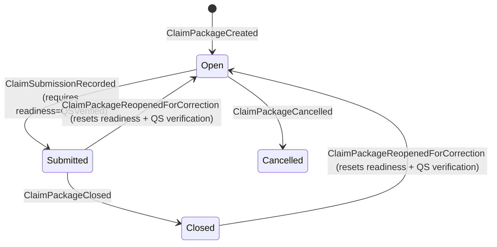
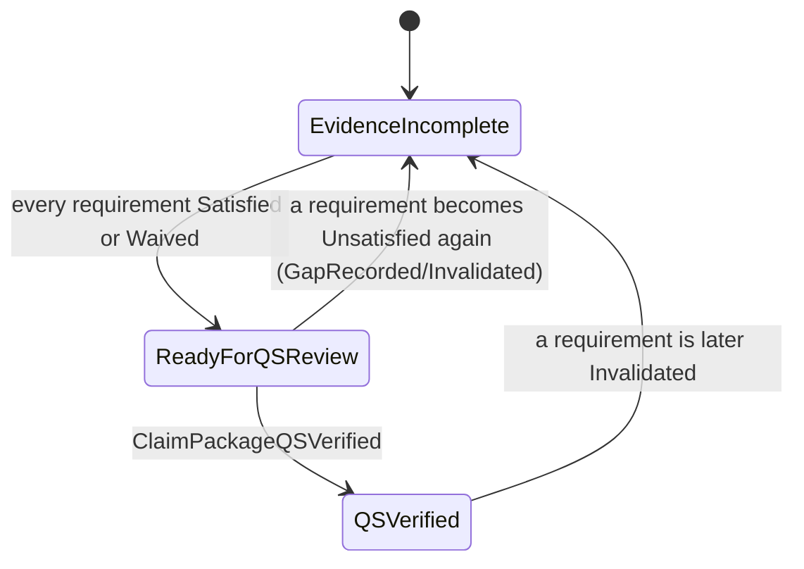

# Business Logic Reverse Engineering

_Generated from code analysis on 2026-07-20 via `arh-business-logic-extractor`_

## 1. Business Purpose

Manages a construction/consultancy **claim package** — a bundle of requirements (each backed by
evidence — receipts or deliverables) that must all be satisfied or formally waived before a
Quantity Surveyor (QS) can verify the package and it can be recorded as submitted. Segregation of
duties is enforced: whoever requests a waiver cannot be the one who approves it.

---

## 2. Actors

- **Claim creator**: opens the claim package for an organisation/project.
- **Requirement contributor**: adds requirements, links evidence (`receipt_evidence` or
  `deliverable` — a structural reference only; this module does not verify the evidence internals
  itself, per the code comment "Authoritative Fact Reference pattern").
- **Evaluator**: judges a requirement `satisfied` or records a `gap`.
- **Waiver requester** / **Waiver approver**: two distinct actors — the approver may never be the
  same actor who requested the waiver (`BOM-CLAIM-003`).
- **Quantity Surveyor (QS)**: verifies the package once every requirement qualifies.
- **Submitter**: records the claim as formally submitted once QS-verified.
- **Closer / Reopener / Canceller**: terminal and correction actions on the claim lifecycle.

---

## 3. Preconditions

- A claim package is identified by `claimPackageId`; commands against a nonexistent id fail with
  `claim_not_found` (except `CreateClaimPackage`, which requires the _opposite_ — no existing state).
- Every command carries an actor id and an event timestamp; a non-finite date fails validation
  (`invalid_event_time`) before any business rule is evaluated.
- Requirement-scoped commands (`LinkClaimEvidence`, `EvaluateClaimRequirement`,
  `RequestClaimRequirementWaiver`, `ApproveClaimRequirementWaiver`, `InvalidateClaimEvidence`)
  require the target `requirementId` to already exist on the claim.

---

## 4. Main Flow

1. **Create claim package**: reference + description + org/project ids → `lifecycle: Open`,
   `readiness: EvidenceIncomplete`, no requirements yet.
2. **Add requirements** (only while `Open`): each starts `Unsatisfied`, no evidence, no waiver.
3. **Link evidence** to a requirement (receipt or deliverable reference).
4. **Evaluate** a requirement — must currently be `Unsatisfied`:
   - Outcome `satisfied` → `RequirementSatisfied`.
   - Otherwise → `GapRecorded` (requirement stays `Unsatisfied`, but now carries a `gapNote`).
5. **Waiver path** (alternative to evaluation) for a still-`Unsatisfied` requirement:
   - Request a waiver (reason required); rejected if a waiver is already pending.
   - Approve the waiver — **must be a different actor** than the requester; requirement becomes
     `Waived`.
6. **Readiness is derived, never set directly** (`deriveReadiness`, `claim.ts:71-79`): once every
   requirement is `Satisfied` or `Waived`, readiness becomes `ReadyForQSReview` (or stays
   `QSVerified` if it already was, until something invalidates that).
7. **QS verifies** the package — only legal when `readiness === ReadyForQSReview` → readiness
   becomes `QSVerified`, verification notes recorded.
8. **Record submission** — only legal when `lifecycle === Open` AND `readiness === QSVerified` →
   `lifecycle: Submitted`.
9. **Close** — only legal when `lifecycle === Submitted` → `lifecycle: Closed`.
10. **Reopen for correction** — only legal from `Submitted` or `Closed` → forces `lifecycle: Open`,
    `readiness: EvidenceIncomplete`, and **discards** any prior QS verification, even if every
    requirement still qualifies (`CL-13`, `evolve.ts:228-236` — deliberate, not a bug).
11. **Cancel** — only legal while `lifecycle === Open` → `lifecycle: Cancelled` (terminal).
12. **Invalidate evidence** — only legal on a requirement that is currently `Satisfied` or `Waived`
    → becomes `Invalidated`, which (via `deriveReadiness`) can pull the package's readiness back
    down from `ReadyForQSReview`/`QSVerified` to `EvidenceIncomplete`.

---

## 5. Decision Rules

| Condition                                                                                                   | Action                                                                       |
| ----------------------------------------------------------------------------------------------------------- | ---------------------------------------------------------------------------- |
| `CreateClaimPackage` on an id that already has state                                                        | Reject: `claim_already_exists`                                               |
| Reference or description blank/whitespace-only                                                              | Reject: `invalid_reference` / `invalid_description`                          |
| `AddClaimRequirement` when `lifecycle !== Open`                                                             | Reject: `claim_not_open`                                                     |
| `LinkClaimEvidence` / `EvaluateClaimRequirement` / waiver commands on unknown `requirementId`               | Reject: `requirement_not_found`                                              |
| `EvaluateClaimRequirement` when requirement status isn't `Unsatisfied`                                      | Reject: `requirement_not_unsatisfied`                                        |
| `RequestClaimRequirementWaiver` when requirement isn't `Unsatisfied`                                        | Reject: `requirement_not_unsatisfied`                                        |
| `RequestClaimRequirementWaiver` when a waiver is already pending (`waiver !== null && approvedBy === null`) | Reject: `waiver_already_pending`                                             |
| `ApproveClaimRequirementWaiver` when no waiver exists, or it's already approved                             | Reject: `no_pending_waiver`                                                  |
| `ApproveClaimRequirementWaiver` where `approvedBy === waiver.requestedBy`                                   | Reject: `actor_is_waiver_requester` (segregation of duties, `BOM-CLAIM-003`) |
| `VerifyClaimPackage` when `readiness !== ReadyForQSReview`                                                  | Reject: `claim_not_ready_for_qs_review`                                      |
| `RecordClaimSubmission` when `lifecycle !== Open`                                                           | Reject: `claim_not_open`                                                     |
| `RecordClaimSubmission` when `readiness !== QSVerified`                                                     | Reject: `claim_not_qs_verified`                                              |
| `CloseClaimPackage` when `lifecycle !== Submitted`                                                          | Reject: `claim_not_submitted`                                                |
| `InvalidateClaimEvidence` when requirement isn't `Satisfied` or `Waived`                                    | Reject: `requirement_not_qualifying`                                         |
| `ReopenClaimPackageForCorrection` when `lifecycle` isn't `Submitted` or `Closed`                            | Reject: `claim_not_correctable`                                              |
| `CancelClaimPackage` when `lifecycle !== Open`                                                              | Reject: `claim_not_cancellable`                                              |

---

## 6. State Transitions

Two independent state machines evolve together: **lifecycle** (the package's overall status) and
**readiness** (whether requirements currently qualify for QS review). Readiness is _derived_ by
`deriveReadiness`, not set by any command directly.

Per-requirement status: `Unsatisfied -> Satisfied` (evaluation), `Unsatisfied -> Unsatisfied` with a
`gapNote` (gap recorded), `Unsatisfied -> Waived` (via approved waiver), `Satisfied|Waived ->
Invalidated` (evidence invalidated — terminal for that requirement).

---

## 7. Billing / Credit Impact

Not applicable — this module has no charge/credit/quota semantics. Claims here represent
documentation/compliance packages, not financial transactions in themselves (see
`related-business-logic` note below for how this may feed a downstream financial process not
visible in this module).

---

## 8. Exceptions / Edge Cases

- **Waiver already pending, re-request attempted**: explicitly rejected
  (`waiver_already_pending`) rather than silently replacing the pending request.
- **Same actor requests and approves a waiver**: explicitly rejected
  (`actor_is_waiver_requester`) — the only actor-identity business rule in this module.
- **Reopening discards QS verification unconditionally**: even if nothing about the requirements
  changed, reopening a `Submitted`/`Closed` claim always forces a fresh QS review — documented as
  intentional in-code (`CL-13`), not an oversight.
- **Invalidating evidence after QS verification**: `InvalidateClaimEvidence` doesn't check
  `lifecycle` at all — it can fire on a `Submitted` or `Closed` claim's requirement, which recomputes
  readiness downward but does **not** automatically revert `lifecycle` — a `Submitted`/`Closed`
  claim could end up with `readiness: EvidenceIncomplete` while still `lifecycle: Submitted` (see
  Ambiguities).
- **Evidence linking has no status guard**: `LinkClaimEvidence` can be called on a requirement in
  any status (including `Satisfied`, `Waived`, or `Invalidated`), silently overwriting the prior
  evidence link, with no lifecycle or readiness recomputation.

---

## 9. Data Written / Read

**Written** (all via domain events, applied through `evolve`):

- Claim `facts` (immutable after creation): id, org, project, reference, description, creator, timestamp.
- `lifecycle` and `readiness` (each independently derived/mutated per the rules above).
- Per-requirement: `status`, `evidence`, `waiver`, `gapNote`.
- `qsVerification` record (verifier, timestamp, notes) — cleared on reopen.

**Read:**

- Current `ClaimState` (rebuilt by replaying events through `evolve`, standard event-sourcing
  read model) before every `decide()` call.

---

## 10. Ambiguities / Questions

- ⚠️ **Unclear**: If `InvalidateClaimEvidence` fires on a requirement belonging to a `Submitted` or
  `Closed` claim, `readiness` can drop to `EvidenceIncomplete` while `lifecycle` stays `Submitted`/
  `Closed` — is a `Submitted` claim with non-qualifying requirements a valid, expected state, or
  should invalidation itself be blocked outside `Open`? — `evolve.ts:202-216` has no lifecycle guard.
- ⚠️ **Unclear**: `LinkClaimEvidence` has no requirement-status guard — is re-linking evidence on an
  already `Satisfied`/`Waived`/`Invalidated` requirement intentional (e.g. for correction), or
  should it be rejected like other requirement-scoped commands are once a requirement leaves
  `Unsatisfied`? — `decide.ts:73-90`.
- ⚠️ **Missing**: This module explicitly does not verify `evidenceId` against the
  receipt-evidence/deliverable modules ("Authoritative Fact Reference pattern", `claim.ts:15-17`)
  — where does that verification happen, and what happens if the referenced evidence is later
  deleted or invalidated in its own module?
- ⚠️ **Unknown**: How (or whether) a claim package's outcome feeds into any billing/payment process
  downstream — this module has no billing section by design, but the business purpose of a "claim"
  in a consultancy context usually implies eventual payment; that link isn't visible from this
  module alone.

---

## 11. Code References

- Command handling / business rules: `src/modules/claim/domain/decide.ts:1-315`
- State shape + derived readiness: `src/modules/claim/domain/claim.ts:1-80` (`deriveReadiness`, `claim.ts:71-79`)
- Event application / state machine: `src/modules/claim/domain/evolve.ts:1-253`
- Segregation-of-duties rule: `decide.ts:161-164` (`BOM-CLAIM-003`)
- Reopen-resets-readiness rule: `evolve.ts:228-236` (`CL-13`)
- Related: `src/modules/receipt-evidence/`, `src/modules/deliverable/` (evidence sources referenced
  structurally, not verified, by this module)

---

_End of analysis_
